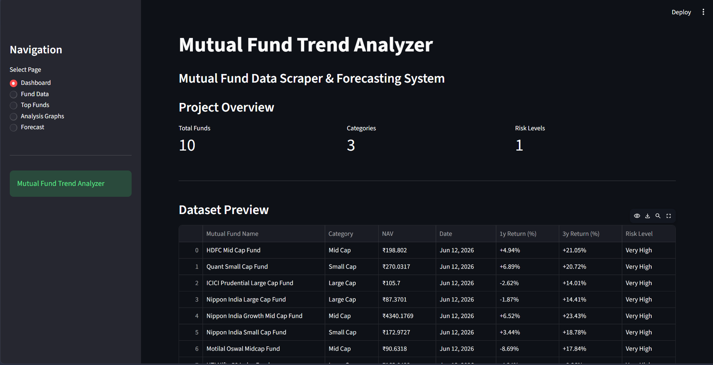
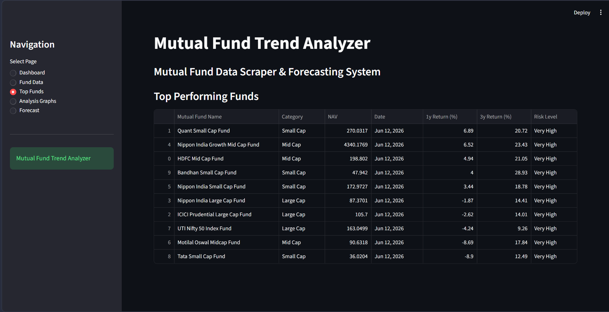

# 📈 Mutual Fund Data Scraper & Basic Forecasting System
#### Hello, I'm Akshya. I build a Project basis on colecting mutual fund data, analysing and forcast the data. In this project we scrape the data from onlline websites.

#### like: Groww, ET Money

#### A Python-based system that automatically collects mutual fund data, performs analysis, visualizes trends, and predicts future NAV movements using basic forecasting techniques.

---

# Features

### 🔷 Mutual Fund Data Scraping

### 🔷 Automated CSV Generation

### 🔷 Data Cleaning & Processing

### 🔷 Performance Analysis

### 🔷 Risk Analysis

### 🔷 Trend Visualization

### 🔷 Linear Regression Forecasting

### 🔷 Interactive Streamlit Dashboard

---

# 📸 Screenshots

## Dashboard

## Top Funds Analysis

## Forecasting Results


---

# 🏗️ Project Architecture

```text
Web Sources
     │
     ▼
Data Scraping
     │
     ▼
CSV Storage
     │
     ▼
Data Cleaning
     │
     ▼
Analysis & Visualization
     │
     ▼
Forecasting
     │
     ▼
Streamlit Dashboard
```

---

# 📂 Project Structure

```text
Mutual_Fund_Project/
│
├── scraper.py
├── analysis.py
├── forecasting.py
├── dashboard.py
│
├── requirements.txt
├── README.md
│
├── Mutual_Fund_Datas/
│   ├── mutual_fund_analysis.csv
│   ├── mutual_funds_cleaning.csv
│   ├── historical_nav.csv
│   └── forecast_30_days.csv
│
├── Reports/
│   ├── mutual_fund_report.txt
│   └── forecast_report.txt
│
├── Analysis/
│   ├── top_10_funds_1y_return.png
│   ├── top_10_funds_3y_return.png
│   ├── top_10_funds_1y_vs_3y_return.png
│   ├── avg_1y_risk_return.png
│   ├── avg_3y_risk_return.png
│   ├── category_analysis.csv
│   └── correlation_matrix.csv
│
├── Forecasting_graph/
│   ├── moving_averages.png
│   └── nav_forecast.png
│
├── Documentation/
│   ├── Project_Report.md
│   ├── CERTIFICATE.md
│   └── Presentation.pptx
│
└── Screenshots/
    ├── dashboard.png
    └── analysis.png
```

---

# 🛠️ Technologies Used

## Programming Language

* ### Python

## Libraries

* ### Requests
* ### BeautifulSoup4
* ### Pandas
* ### NumPy
* ### Matplotlib
* ### Scikit-Learn
* ### Streamlit

## Tools

* ### VS Code
* ### GitHub

---

# ⚙️ Installation

## Clone the repository:

#### git clone https://github.com/GHOST-776-king/Mutual_Fund_Project.git

```bash
cd Mutual_Fund_Project
```

## Install dependencies:

```bash
pip install -r requirements.txt
```

---

# ▶️ How to Run

### Step 1: Scrape Data

```bash
python scraper.py
```

### Step 2: Analyze Data

```bash
python analysis.py
```

### Step 3: Generate Forecast

```bash
python forecasting.py
```

### Step 4: Launch Dashboard

```bash
python -m streamlit run dashboard.py
```

---

# 📊 Analysis Performed

* ### Top 10 Funds by 1-Year Return
* ### Top 10 Funds by 3-Year Return
* ### Risk Level Analysis
* ### Category Analysis
* ### Return Comparison
* ### Correlation Analysis

---

# 🔮 Forecasting Method

## The forecasting module uses:

* ### Historical NAV Simulation
* ### Moving Average Analysis
* ### Linear Regression Model
* ### 30-Day Future NAV Prediction

## Generated Outputs:

* ### Historical NAV Dataset
* ### Moving Average Graphs
* ### Forecast Graph
* ### Forecast Report
* ### Future NAV CSV

---

# 📈 Results

## The system successfully:

* ### Collected Mutual Fund Data
* ### Cleaned and Processed Data
* ### Generated Visual Insights
* ### Identified Top Performing Funds
* ### Predicted Future NAV Trends
* ### Displayed Results Through Dashboard

---

# 🔄 Future Improvements

* ### Real Historical NAV APIs
* ### ARIMA Forecasting
* ### LSTM Deep Learning Models
* ### Real-Time Updates
* ### Investment Recommendation System
* ### Portfolio Analysis

---

# 👨‍💻 Author

## *Akshya Jangir*

#### Python Developer | Enthusiast personality

#### GitHub: https://github.com/GHOST-776-king

---

# ⭐ Support

#### If you found this project useful, consider giving it a star ⭐ on GitHub.
